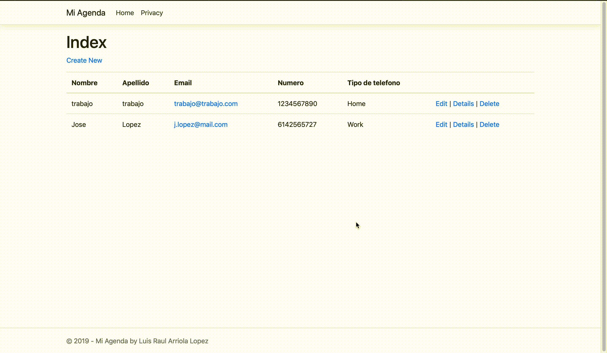
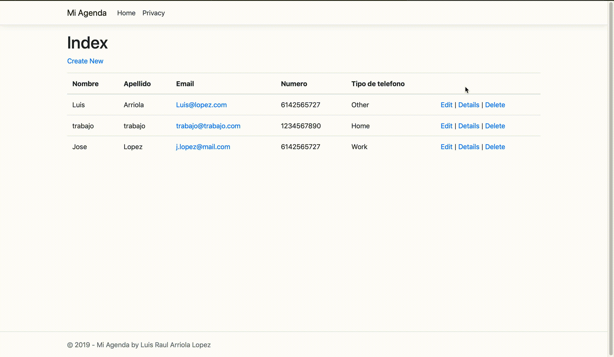

# Agenda C#

## Advantages and disadvantages of the programming language.

### Advantages

- Good integration with Windows.
- Close syntax with Java: This makes it easy to learn if you already have experience with Java.
- Compiled language: The code stored on a public-facing server is in binary form. If the server is ever hacked, the hacker only has access to the binary, no to the source code.

### Disadvantages

- Compiled language: It has to be compiled every time a change is made.
- IIS server: Because it is part of the .NET framework a Windows server is needed. 

## Advantages and disadvantages of the web application framework/stack.

### Advantages

- Object oriented
- Mature Framework: The standard library is task-based. Because the library is organized into inheritable classes related to a given task, such as XML or image editing, developers can save time on many common development tasks.

### Disadvantages

- Resource intensive: Because it uses far more web server resources than PHP or other languages, so it requires either better servers or a greater number of them
- Documented history of bugs and vulnerabilities.

## Most common technologies used with the platform/framework

## Most popular IDEs

- Microsoft Visual Studio: Only available on Windows, Visual Studio is a full IDE primarly inteded for .NET development. It also supports languages such as C# and F#.

- Visual Studio Code: A text editor similar to Atom or SublimeText. It runs on Windows, OSX and Linux.

## What type of applications the framework is best suited for?
Best suited for applications expecting lots of traffic. In an organization that is willing to use windows in all the aspects of the development and execution.

## GIFs
### Create

### Read

### Update

### Delete

### Sources

https://agilites.com/pros-and-cons-of-using-c-as-your-backend-programming-language.html

https://www.orientsoftware.net/technologies/microsoft-net/aspnet-vs-php/
